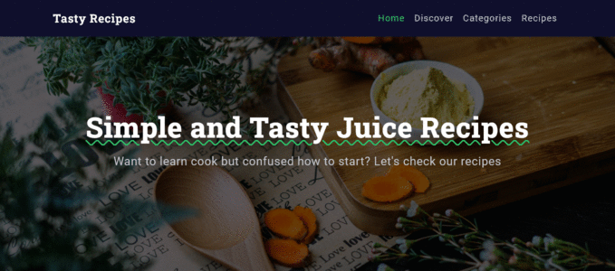

<!-- Please update value in the {}  -->

<h1 align="center">Recipes App</h1>

<div align="center">

[](https://apprecipes1.netlify.app/)

</div>


<!-- TABLE OF CONTENTS -->

## Table of Contents

- [Overview](#overview)
- [Built With](#built-with)
- [Resources](#Resources)

<!-- OVERVIEW -->

## Overview



This app was built with the purpose to better my programming skills the app is about recipes I use [TheMealDB](https://www.themealdb.com/api.php) to get all the recipes in the app you can filter recipes by categories, countries and ingredients.

My experience to develop this project was a fascinating at the beginning I didn't have any idea what will be the design for this app that was a challenge for me, but I got some inspiration using websites such as [Dribbble](https://dribbble.com/) also I had some obstacles on the way for instance the API didn't have pagination I had to research how to create a local pagination.

I learned a lot of things developing this app, for example I learned how to use lazy loading in angular.


### Built With

<!-- This section should list any major frameworks that you built your project using. Here are a few examples.-->


  - Angular
  - SCSS
  - Typescript
  - BEM (block__element--modifier)
  - Mobile-first workflow


## Resources
These are some resources that I used to develop the app.

<!-- This section should list any articles or add-ons/plugins that helps you to complete the project. This is optional but it will help you in the future. For example: -->

- [Trabajando con Lazy Loading en Angular 8–9](https://mugan86.medium.com/trabajando-con-lazy-loading-en-angular-8-e1611ce2c46f)
- [Paginación local filtro](https://www.youtube.com/watch?v=cPTcn7mpKIQ)
- [Useful Sass (SCSS) media query mixins](https://glennmccomb.com/articles/useful-sass-scss-media-query-mixins-for-bootstrap/)
- [Sweetalert2](https://sweetalert2.github.io/)


## How To Use

<!-- Example: -->

To clone and run this application, you'll need [Git](https://git-scm.com) and [Node.js](https://nodejs.org/en/download/) (which comes with [npm](http://npmjs.com)) installed on your computer. From your command line:

```bash
# Clone this repository
$ git clone hhttps://github.com/VladimirValdes/recipesApp

# Install dependencies
$ npm install

# Run the app
$ ng serve
```


<!-- ## Contact

- Website [your-website.com](https://{your-web-site-link})
- GitHub [@your-username](https://{github.com/your-usermame})
- Twitter [@your-twitter](https://{twitter.com/your-username}) -->
